hexo next 这个博客主题挺流行的，但是有一些显示效果不是很喜欢，一般来说我们可以 git clone 下来 next 这个主题源码再进行修改相应的样式，不过 next 提供了自定义 css 的能力，通过提供一个自定义的 style 文件就可以相应的修改显示效果，参考官方链接的使用方法[Custom Files](https://theme-next.js.org/docs/advanced-settings/custom-files#Hide-Keep-on-posting-in-Archive-Page)，下面分享一下我做的一些修改。
<!--more-->
# 如何修改
## 定位CSS
这个其实通过浏览器的开发者工具页面可以找到，我们找到相应元素的 css 类，然后可以自行调整其中的属性值达到我们
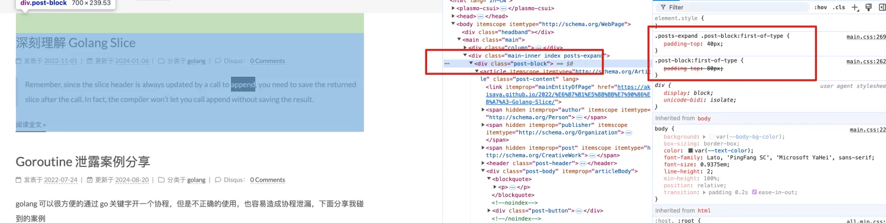
## next style 配置
参考 [Custom Files](https://theme-next.js.org/docs/advanced-settings/custom-files#Hide-Keep-on-posting-in-Archive-Page)，在 `source/_data/styles.styl`中添加 css
添加类选择器的时候最好按照浏览器显示的类选择器一起 copy 下来，如下所示
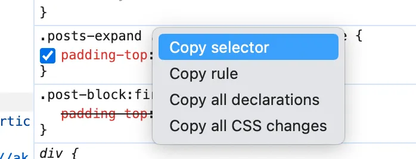
然后在 style 文件中添加修改项
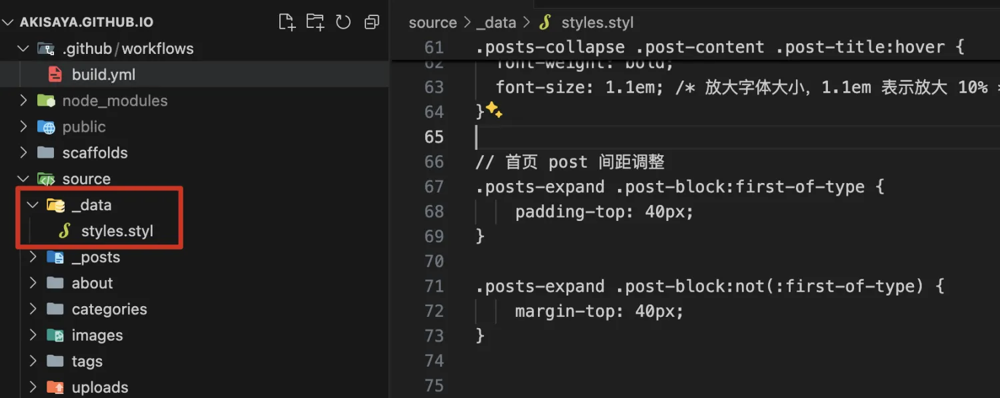
# 我的修改
**注：本文的修改都是基于 NexT.Mist 主题调整的, 主页 post 调整只在 NexT.Mist 生效，archive 页的调整基本都适用于其他 NexT 主题**
## 主页
### post 更加紧凑
调整后
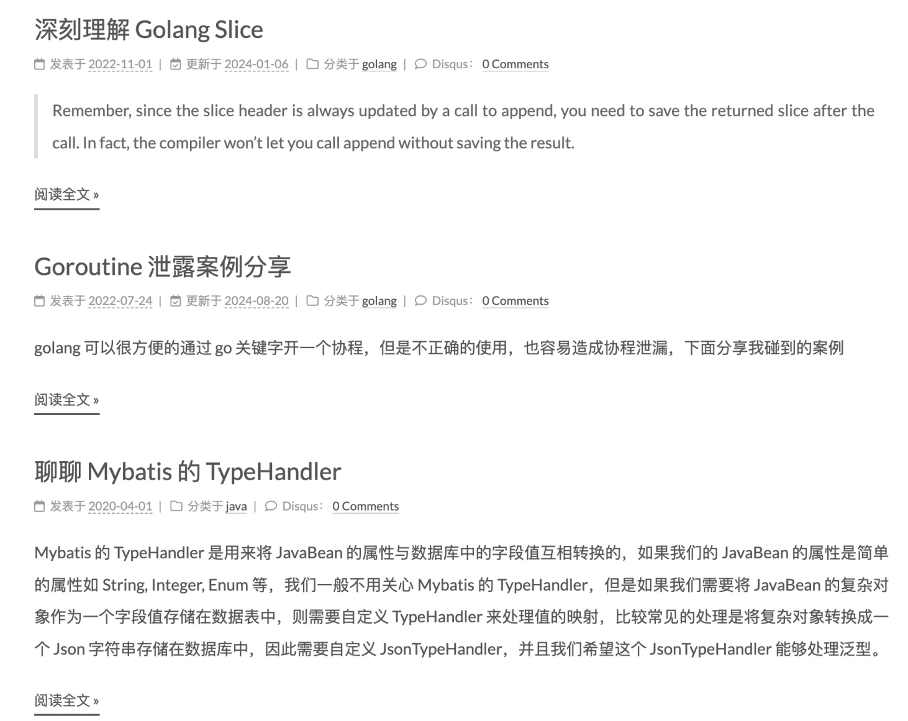
```css
.posts-expand .post-block:first-of-type {
  padding-top: 40px;
}

.posts-expand .post-block:not(:first-of-type) {
  margin-top: 60px;
}
```
原来的 post 之间间隔太大了，首页点进去感觉过于稀疏了

### 翻页按键边缘与 post 边缘对齐，翻页按键与 post 间距缩小
调整前，间距大，按钮边缘没对齐
<!--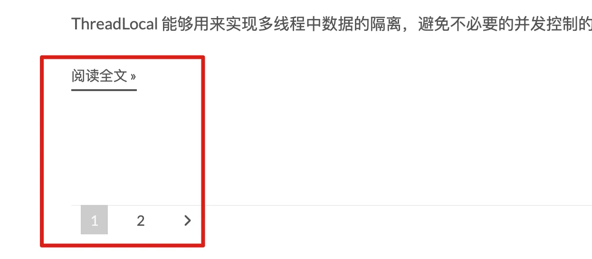-->
<div style="clear: both;"></div>
调整后
<!--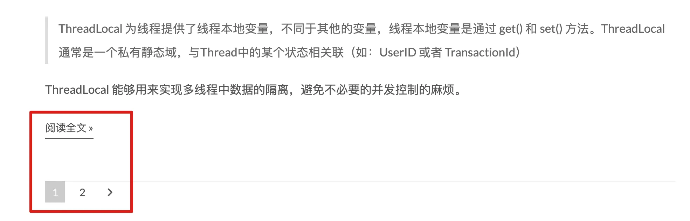-->
<div style="clear: both;"></div>

```css
// 分页  
.pagination {
  margin: 60px 0 0;
}

.pagination .prev, .pagination .next, .pagination .page-number, .pagination .space {
    margin: -1px 10px 0 0;
    padding: 0 10px;
}
```
## 归档页面
### 去掉归档页的文档统计
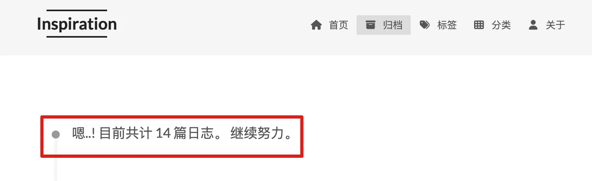
```css
.posts-collapse .post-content .collection-title {
  display: none !important;
}
```
### 年份缩进，标题间距调整，标题字体放大，竖线改细等
调整前
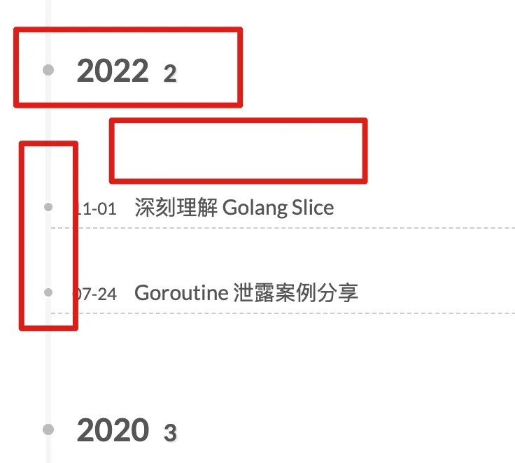
调整后
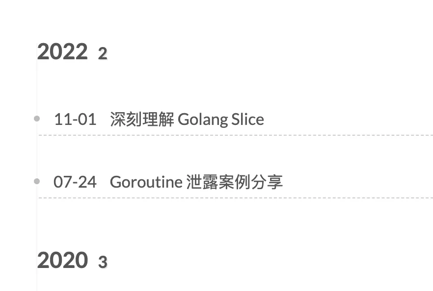
```css
// 竖线是这个 before 元素控制的，改细，同时稍微一动位置与标题栏前的圆心对齐
// 左侧的竖线原来太抢眼了，这里弱化竖线的视觉效果
.posts-collapse .post-content::before {
  background: var(--archive-post-content-before-color)
  margin-left: -0.5px
  top: 1em
  width: 1px
}

// 年份缩进，看起来就更有层次感
.posts-collapse .post-content .collection-year {
  margin: 40px 0 0 0;
}

// 去掉掉年份前的圆点
.posts-collapse .post-content .collection-year::before {
  display: none;
}

// 调整归档页面的上的间距
.posts-collapse .post-content .collection-header {
  margin: 0 0 0 0;
}

// 文档标题字体整体放大，强调一下视觉效果
.posts-collapse .post-content .post-header{
  font-size: 1.1em
}
// 文档标题前的日期字体方法，原来其实是个缩小效果，这么写之后就取消了缩小效果
.posts-collapse .post-content .post-meta-container {
  font-size: inherit; /* or use initial or unset */
}
// 减小页面最上方的空隙
.archive .post-block:first-of-type {
    padding-top: 0;
}
```
### 竖线的夜间模式
调整前
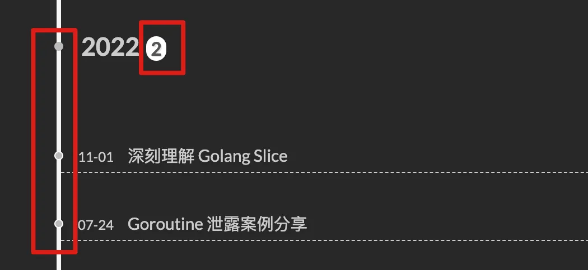
调整后
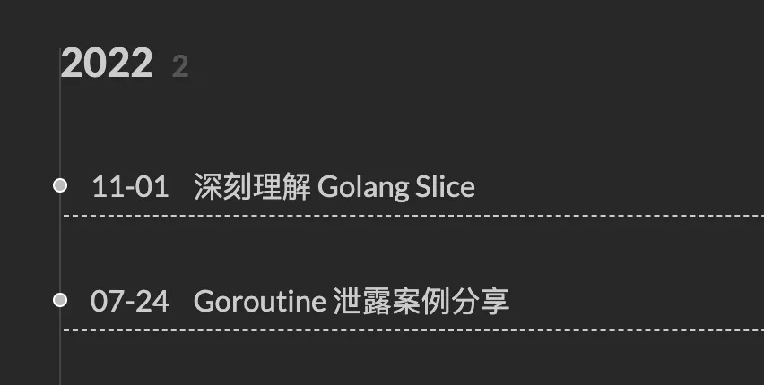
```css
:root {
  --archive-post-content-before-color: #f5f5f5
}

if (hexo-config('darkmode')) {
  @media (prefers-color-scheme: dark) {
    :root {
      --archive-post-content-before-color: #454545
    }
  }
}

// 这里竖线的颜色使用到了 css 的变量，然后在 :root 上面定义了日间和夜间模式使用的颜色值
// 这个定义变量的方式从next代码里趴出来的
.posts-collapse .post-content::before {
  background: var(--archive-post-content-before-color)
  margin-left: -0.5px
  top: 1em
  width: 1px
}

// 年份数量统计有背景色，这里取消掉
.posts-collapse .post-content .collection-year::before {
  display: none;
}
```
[next 定义的 css color 变量](https://github.com/next-theme/hexo-theme-next/blob/master/source/css/_colors.styl)
### 文档标题添加动画
调整前
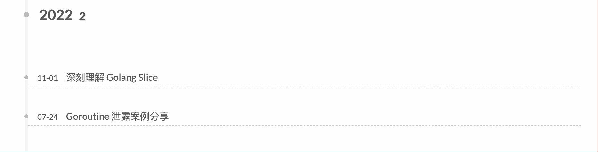
调整后
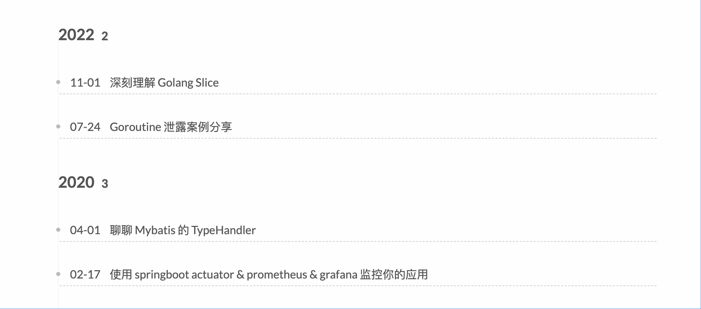
可以看出来调整后的选中效果明显更好了
```css
// 归档页 title 添加选中的加粗放大效果和动画
.posts-collapse .post-content .post-title {
  transition: font-size 0.1s ease, font-weight 0.1s ease; /* 添加过渡动画 */
}

.posts-collapse .post-content .post-title:hover {
  font-weight: bold;
  font-size: 1.1em; /* 放大字体大小，1.1em 表示放大 10% */
}
```
一个小技巧是，在调试的时候可以通过图示的方法显示 hover 后的显示效果，这点击后可以看到加粗
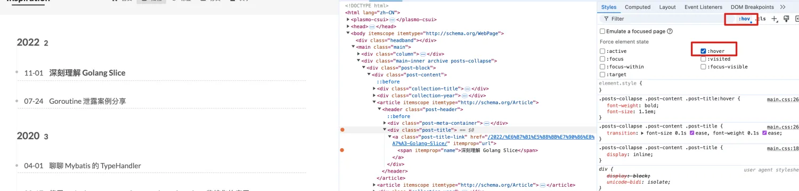


## 超链接
原始主题超链接与正文文字颜色相近，仅仅添加一个比较浅的下划线，如果想改超链接的显示颜色，可以添加如下代码
```css
:root {
  --post-body-link-color: #b84848
  --post-body-link-hover-color: #db5a5a
}

if (hexo-config('darkmode')) {
  @media (prefers-color-scheme: dark) {
    :root {
      --post-body-link-color: #c5603e
      --post-body-link-hover-color: #e5724b
    }
  }
}

// 修改正文中的超链接颜色,但不修改阅读原文的链接颜色
.post-body a:not(.btn) {
  color: var(--post-body-link-color) //超链接显示颜色
  border-bottom-color: var(--post-body-link-color)
  &:hover {
    color: var(--post-body-link-hover-color);  //鼠标移动上去后超链接颜色
    border-bottom-color: var(--post-body-link-hover-color)
  }
}
```


# 最后附上完整的修改
```css
:root {
  --archive-post-content-before-color: #f5f5f5
  --post-body-link-color: #b84848
  --post-body-link-hover-color: #db5a5a
}

if (hexo-config('darkmode')) {
  @media (prefers-color-scheme: dark) {
    :root {
      --archive-post-content-before-color: #454545
      --post-body-link-color: #c5603e
      --post-body-link-hover-color: #e5724b
    }
  }
}

// 调整归档页面 css 样式
// 隐藏归档页面总文章title
.posts-collapse .post-content .collection-title {
  display: none !important;
}

// 竖线是这个 before 元素控制的，改细，同时稍微一动位置与标题栏前的圆心对齐
// 左侧的竖线原来太抢眼了，这里弱化竖线的视觉效果
.posts-collapse .post-content::before {
  background: var(--archive-post-content-before-color)
  margin-left: -0.5px
  top: 1em
  width: 1px
}

.posts-collapse .post-content .collection-year .collection-year-count {
  background: none
}

// 年份缩进，看起来就更有层次感
.posts-collapse .post-content .collection-year {
  margin: 40px 0 0 0;
}

// 去掉掉年份前的圆点
.posts-collapse .post-content .collection-year::before {
  display: none;
}

// 调整归档页面的上的间距
.posts-collapse .post-content .collection-header {
  margin: 0 0 0 0;
}

// 文档标题字体整体放大，强调一下视觉效果
.posts-collapse .post-content .post-header{
  font-size: 1.1em
}

// 文档标题前的日期字体方法，原来其实是个缩小效果，这么写之后就取消了缩小效果
.posts-collapse .post-content .post-meta-container {
  font-size: inherit; /* or use initial or unset */
}
// 减小页面最上方的空隙
.archive .post-block:first-of-type {
    padding-top: 0;
}


// 归档页 title 添加选中的加粗放大效果和动画
.posts-collapse .post-content .post-title {
  transition: font-size 0.1s ease, font-weight 0.1s ease; /* 添加过渡动画 */
}

.posts-collapse .post-content .post-title:hover {
  font-weight: bold;
  font-size: 1.1em; /* 放大字体大小，1.1em 表示放大 10% */
}

// 首页 post 间距调整
.posts-expand .post-block:first-of-type {
    padding-top: 40px;
}

.posts-expand .post-block:not(:first-of-type) {
    margin-top: 60px;
}


// 分页  
.pagination {
  margin: 60px 0 0;
}

.pagination .prev, .pagination .next, .pagination .page-number, .pagination .space {
    margin: -1px 10px 0 0;
    padding: 0 10px;
}


// 减小 tag 页面最上方的空隙
.tag .post-block:first-of-type {
    padding-top: 0;
}

// 减小 category 页面最上方的空隙
.category .post-block:first-of-type {
    padding-top: 0;
}

// 修改正文中的超链接颜色,但不修改阅读原文的链接颜色
.post-body a:not(.btn) {
  color: var(--post-body-link-color) //超链接显示颜色
  border-bottom-color: var(--post-body-link-color)
  &:hover {
    color: var(--post-body-link-hover-color);  //鼠标移动上去后超链接颜色
    border-bottom-color: var(--post-body-link-hover-color)
  }
}

```