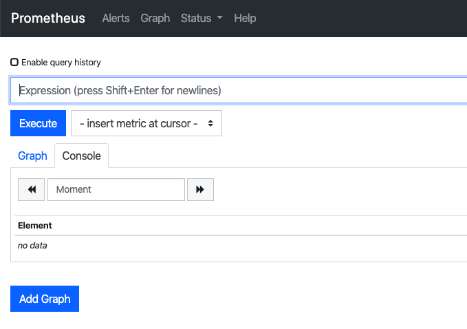
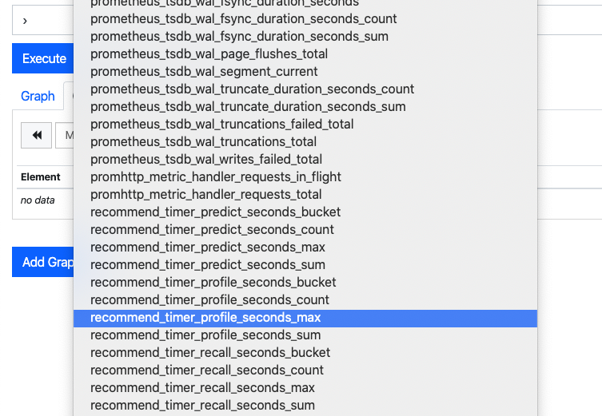
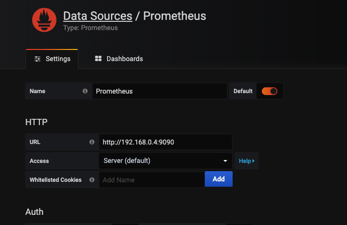
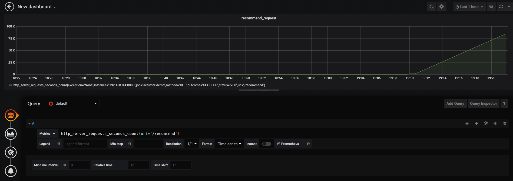
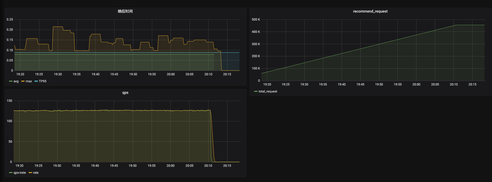

线上的项目经常需要对一些指标如请求量，qps，延时等指标做统计方便我们观察系统的运行状态，并帮助我们定位系统可能存在的性能等问题。springboot actuator 为 springboot 应用提供了指标的统计方法，prometheus 是一个监控中心，grafana 则是一个数据展示中心，本文将通过一个小案例介绍综合使用 springboot actuator、prometheus、grafana 监控我们的应用。
<!-- more -->
## springboot actuator
### 引入 springboot actuator
引入 actuator 依赖即可开始使用 springboot actuator 为我们提供的各种监控指标
```
<dependencies>
    <dependency>
        <groupId>org.springframework.boot</groupId>
        <artifactId>spring-boot-starter-actuator</artifactId>
    </dependency>
</dependencies>
```
默认情况下 actuator 提供了很多的监控端点（EndPoint），路径均为 `/actuatro/<endpoint_name>`，比如应用健康信息 health, 访问 `/actuator/health`，可得到如下返回
```json
{
  "status": "UP"
}
```
为了提供能被 prometheus 解析收集的监控信息，我们需要启用 prometheus 端点并添加 prometheus 依赖
```xml
# application.properties
management.endpoints.web.exposure.include=info,health,prometheus

# pom.xml
<dependency>
    <groupId>io.micrometer</groupId>
    <artifactId>micrometer-registry-prometheus</artifactId>
</dependency>
```
访问 `/actuator/prometheus` 得到
```
# HELP process_start_time_seconds Start time of the process since unix epoch.
# TYPE process_start_time_seconds gauge
process_start_time_seconds 1.581927873353E9
# HELP jvm_threads_states_threads The current number of threads having NEW state
# TYPE jvm_threads_states_threads gauge
jvm_threads_states_threads{state="runnable",} 9.0
jvm_threads_states_threads{state="blocked",} 0.0
jvm_threads_states_threads{state="waiting",} 13.0
jvm_threads_states_threads{state="timed-waiting",} 2.0
jvm_threads_states_threads{state="new",} 0.0
jvm_threads_states_threads{state="terminated",} 0.0
# HELP process_files_open_files The open file descriptor count
# TYPE process_files_open_files gauge
process_files_open_files 96.0
# HELP system_load_average_1m The sum of the number of runnable entities queued to available processors and the number of runnable entities running on the available processors averaged over a period of time
# TYPE system_load_average_1m gauge
system_load_average_1m 1.30322265625
...
```
可以看到这些数据是符合 prometheus 定义的数据收集的格式的，默认提供了 jvm, cpu 和 web 等方面的指标
我们给 web 应用定义了 `/index`,`/recommend` 的接口，访问一下这些接口后再看看 `/actuator/prometheus`的输出结果，发现多了
```
# HELP http_server_requests_seconds  
# TYPE http_server_requests_seconds summary
http_server_requests_seconds_count{exception="None",method="GET",outcome="SUCCESS",status="200",uri="/index",} 1.0
http_server_requests_seconds_sum{exception="None",method="GET",outcome="SUCCESS",status="200",uri="/index",} 0.013830247
http_server_requests_seconds_count{exception="None",method="GET",outcome="SUCCESS",status="200",uri="/actuator/prometheus",} 3.0
http_server_requests_seconds_sum{exception="None",method="GET",outcome="SUCCESS",status="200",uri="/actuator/prometheus",} 0.071013869
http_server_requests_seconds_count{exception="None",method="GET",outcome="SUCCESS",status="200",uri="/recommend",} 1.0
http_server_requests_seconds_sum{exception="None",method="GET",outcome="SUCCESS",status="200",uri="/recommend",} 0.092041806
# HELP http_server_requests_seconds_max  
# TYPE http_server_requests_seconds_max gauge
http_server_requests_seconds_max{exception="None",method="GET",outcome="SUCCESS",status="200",uri="/index",} 0.013830247
http_server_requests_seconds_max{exception="None",method="GET",outcome="SUCCESS",status="200",uri="/actuator/prometheus",} 0.056484717
http_server_requests_seconds_max{exception="None",method="GET",outcome="SUCCESS",status="200",uri="/recommend",} 0.092041806
```
可以看到这些是我们访问这些接口的请求数量和请求时间的相关统计，这些指标是 springboot actuator 默认为我们提供的监控指标，但是有时候我们除了想知道一个接口的总耗时外，也想知道一个接口中各个方法的耗时，又该怎么统计呢？这时候可以使用 Micrometer 在我们的应用中开发相应的统计代码

### Micrometer
Micormeter 为应用的监控提供统一的接口，类似于 slif4，下面以 timer 指标为例
```
@Autowired
private MeterRegistry registry;

public String recommend() throws InterruptedException {
    Timer.Sample sample;

    sample = Timer.start(registry);
    recall();
    sample.stop(registry.timer("recommend.timer.recall"));

    sample = Timer.start(registry);
    profile();
    sample.stop(registry.timer("recommend.timer.profile"));

    sample = Timer.start(registry);
    predict();
    sample.stop(registry.timer("recommend.timer.predict"));

    return "OK";
}
```
我们使用 Timer 统计了各个方法的耗时，并为每个方法的耗时定义了一个诸如 `recommend.timer.recall` 的名字

再次访问 `/actuator/prometheus` 
```
# HELP recommend_timer_recall_seconds_max  
# TYPE recommend_timer_recall_seconds_max gauge
recommend_timer_recall_seconds_max 0.0
# HELP recommend_timer_recall_seconds  
# TYPE recommend_timer_recall_seconds summary
recommend_timer_recall_seconds_count 2.0
recommend_timer_recall_seconds_sum 0.05997796
```
可以看到统计结果中多出了我们对方法耗时的统计指标

### 单指标属性
有时候我们并不满足于知道一个请求的总时间或者一个方法执行的总时间，比如我们想知道这个请求的平均执行时间，TP99的执行时间。这时候我们就可以定义[单指标属性](https://docs.spring.io/spring-boot/docs/current/reference/htmlsingle/#per-meter-properties)，如使用 `management.metrics.distribution.percentiles-histogram` 可以统计出指标的分为图数据
```
# application.properties

management.metrics.distribution.percentiles-histogram.http.server.requests=true
management.metrics.distribution.percentiles-histogram.recommend.timer.recall=true
management.metrics.distribution.percentiles-histogram.recommend.timer.profile=true
management.metrics.distribution.percentiles-histogram.recommend.timer.predict=true
```
`http.server.requests` 是 springboot actuator 自动为我们监控的属性，参考[Spring MVC Metrics](https://docs.spring.io/spring-boot/docs/current/reference/htmlsingle/#production-ready-metrics-spring-mvc)，后面的 `recommend.timer.recall` 等是我们在程序中定义的指标，再次访问接口后的统计数据
```
# HELP recommend_timer_predict_seconds  
# TYPE recommend_timer_predict_seconds histogram
recommend_timer_predict_seconds_bucket{le="0.001",} 0.0
recommend_timer_predict_seconds_bucket{le="0.001048576",} 0.0
recommend_timer_predict_seconds_bucket{le="0.001398101",} 0.0
recommend_timer_predict_seconds_bucket{le="0.001747626",} 0.0
recommend_timer_predict_seconds_bucket{le="0.002097151",} 0.0
recommend_timer_predict_seconds_bucket{le="0.002446676",} 0.0
recommend_timer_predict_seconds_bucket{le="0.002796201",} 0.0
recommend_timer_predict_seconds_bucket{le="0.003145726",} 0.0
recommend_timer_predict_seconds_bucket{le="0.003495251",} 0.0
recommend_timer_predict_seconds_bucket{le="0.003844776",} 0.0
recommend_timer_predict_seconds_bucket{le="0.004194304",} 0.0
recommend_timer_predict_seconds_bucket{le="0.005592405",} 0.0
recommend_timer_predict_seconds_bucket{le="0.006990506",} 0.0
recommend_timer_predict_seconds_bucket{le="0.008388607",} 0.0
recommend_timer_predict_seconds_bucket{le="0.009786708",} 0.0
recommend_timer_predict_seconds_bucket{le="0.011184809",} 0.0
recommend_timer_predict_seconds_bucket{le="0.01258291",} 0.0
recommend_timer_predict_seconds_bucket{le="0.013981011",} 0.0
recommend_timer_predict_seconds_bucket{le="0.015379112",} 0.0
recommend_timer_predict_seconds_bucket{le="0.016777216",} 0.0
recommend_timer_predict_seconds_bucket{le="0.022369621",} 0.0
recommend_timer_predict_seconds_bucket{le="0.027962026",} 0.0
recommend_timer_predict_seconds_bucket{le="0.033554431",} 5.0
recommend_timer_predict_seconds_bucket{le="0.039146836",} 5.0
recommend_timer_predict_seconds_bucket{le="0.044739241",} 5.0
```
可以看到了多出了这些 bucket 相关的统计信息，基于这些统计信息我们就能得到更详细的耗时统计

## prometheus
关于 promethus 的详细介绍可以参考[官网文档](https://prometheus.io/docs/prometheus/latest/getting_started/)或者优质的[第三方文档](https://yunlzheng.gitbook.io/prometheus-book/)，这里我们直接说如何使用

### 使用 docker 安装
定义 `prometheus.yml` 如下
```
# my global config
global:
  scrape_interval:     15s # Set the scrape interval to every 15 seconds. Default is every 1 minute.
  evaluation_interval: 15s # Evaluate rules every 15 seconds. The default is every 1 minute.
  # scrape_timeout is set to the global default (10s).

# Load rules once and periodically evaluate them according to the global 'evaluation_interval'.
rule_files:
# - "first_rules.yml"
# - "second_rules.yml"

# A scrape configuration containing exactly one endpoint to scrape:
# Here it's Prometheus itself.
scrape_configs:
  # The job name is added as a label `job=<job_name>` to any timeseries scraped from this config.
  - job_name: 'prometheus'

    # metrics_path defaults to '/metrics'
    # scheme defaults to 'http'.
    static_configs:
      - targets: ['localhost:9090']

  - job_name: 'actuator-demo'
    metrics_path: '/actuator/prometheus'
    scrape_interval: 5s
    static_configs:
      - targets: ['192.168.0.4:8080']
```
由于我们用 docker 方式启动 prometheus，因此 target 中的 ip 填写本机的 ip 地址

```
docker run -p 9090:9090 -v path_to_prometheus.yml:/etc/prometheus/prometheus.yml prom/prometheus
```
访问 localhost:9090 即可打开 prometheus 的 web 页面，并且能看到我们之前在程序中自定义的指标




## grafana
grafana 可以对接多种数据源并且在一个 dashboard 中添加多个 panel 展示不同的数据，我们使用 docker 安装 grafana
```
docker run -d --name=grafana -p 3000:3000 grafana/grafana
```
然后登录 localhost:3000，默认的用户名和密码是 admin/admin，我们添加刚才的 prometheus 为数据源

然后添加一个 query


使用 promQL 我们可以统计更多的指标

```
# 统计访问 /recommend 的 qps
irate(http_server_requests_seconds_count{uri='/recommend'}[1m])

# 统计平均时间
rate(http_server_requests_seconds_sum{uri="/recommend"}[1m])/rate(http_server_requests_seconds_count{uri="/recommend"}[1m])

# 计算最大时间
http_server_requests_seconds_max{uri="/recommend"}

## 计算TP95
histogram_quantile(0.95, http_server_requests_seconds_bucket{uri='/recommend'})
```


