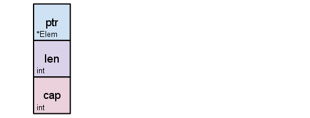
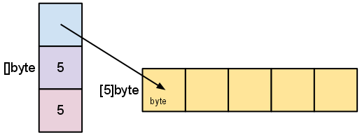
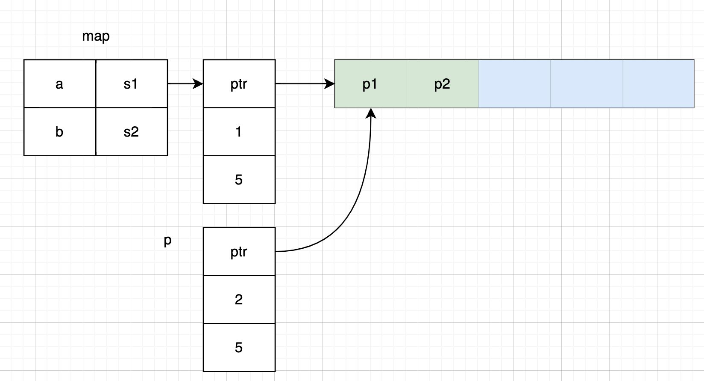

> Remember, since the slice header is always updated by a call to append, you need to save the returned slice after the call. In fact, the compiler won't let you call append without saving the result.
<!--more-->

golang 中数组是指定了长度和类型的一种数据结构，一旦声明其长度便不可更改，因此数组在 golang 中并不实用，用得更多的是 `slice`，以数组为基础的一种“动态数组”。
```go
s := []string{"a", "b", "c"}
s = append(s, "d") // ["a", "b", "c", "d"]
```
向 slice 里添加数据，必须使用内置关键字 append，并且需要接受返回值。
我们知道，在 golang 中，一切都是值传递，也就是向一个函数传递变量，其实是对变量做了一个 copy，因此如 swap 函数如果直接传值而非指针并不能交换入参数的值。
```go
func swap(a int, b int) {
    t := a
    a = b
    b = t
}
```
但是我们如果传入一个 slice，如 double 函数，确可以改变数组的内容
```go
func double(s []int) {
	for i, v := range s {
		s[i] = v * 2
	}
}

func TestDouble(t *testing.T) {
	s := []int{1, 2, 3}
	double(s)
	fmt.Println(s) // [2 4 6]
}
```
slice 的底层其实仍然是个数组，slice 这个数据结构持有了底层数组的指针，slice 长度和容量，如图所示

真实的结构如下：
```go
type slice struct {
	array unsafe.Pointer
	len   int
	cap   int
}
```
如果创建一个slice `s := make([]byte, 5)`，其数据底层结构如图所示

这个时候，我们很容易把 slice 就当成一个引用类型了。特别是有如 java 使用经验的人可能就会误用 slice

比如我们想把 slice 当作方法的参数传递，来为 slice 添加数据。
```go
func add(s []string, v string) {
	s = append(s, v)
}


func sliceTest(t *testing.T) {
    var s []string
    add(s, "a")
    fmt.Println(s)
}
// 输出为 空
```
乍一看会以为这段程序没问题。实际上我们的 add 函数并没有改变函数外的 s。我们仍然需要向下面这样传递至指针
```go
func add(s *[]string, v string) {
	*s = append(*s, v)
}

func sliceTest(t *testing.T) {
    var s []string
    add(&s, "a")
    fmt.Println(s)
}
// 输出 [a]
```
为什么会如此呢？时刻理解 slice 本身并不是指针。当作参数传递时，我们其实已经再操作另外一个 slice 了。尽管方法里和方法外的 slice 可能指向了同一个数组（仔细回顾下 slice 的实际结构，想想这个赋值的过程）

再比如下面这段代码，我们要对一个list做 group by 的操作，得到一个 map，value 就是一个 slice，很容易得到思路 key 不存在时创建 slice，否则拿到这个 slice 并更新
```go
type Pair struct {
	U   string
	Pid string
}

func TestGroupBy(t *testing.T) {
	data := []Pair{
		{U: "a", Pid: "p1"},
		{U: "a", Pid: "p2"},
		{U: "a", Pid: "p3"},
		{U: "b", Pid: "p2"}}

	m := make(map[string][]string)
	for _, p := range data {
		if q, ok := m[p.U]; ok {
			q = append(q, p.Pid) // wrong line
		} else {
			m[p.U] = []string{p.Pid}
		}
	}
	fmt.Println(m) // map[a:[p1] b:[p2]]
}
```
注意到最终输出并不对。 

这里聪明的读者可能会说，因为 slice 扩容了，所以底层数组实际已经发生了改变。
没错，slice 如果发生扩容，如果 slice 原来持有 a1 的指针，扩容时会初始化一个新的数组 a2，容量是原来的一倍，并将 a1 中的元素都拷贝到 a2 中，slice 中数组指针也更新指向 a2，a1如无其他引用则等待 gc 回收。
那我们如果在初始化 map 中的 slice 时就给他一个足够大的 slice 确保不会发生扩容呢
```go
func TestGroupBy(t *testing.T) {
    ...
	m := make(map[string][]string)
	for _, p := range data {
		if q, ok := m[p.U]; ok {
			q = append(q, p.Pid)
		} else {
            // 初始化容量 5 的 slice，确保不扩容
			s := make([]string, 0, 5)
            s = append(s, p.Pid)
            m[p.U] = s
		}
	}
	fmt.Println(m) // map[a:[p1] b:[p2]]
}
```
我们发现结果还是错的。
仔细审视代码发现，我们犯了一个教条式的错误 `q = append(q, p.Pid)`，更新数组的时候，我们很自然的用 q 去接收了。
再回头看看 slice 的结构是由三个字段组成的，**数组指针、len **和** cap**，这三个字段唯一构成了 slice 的一个视图，决定用户能访问到什么数据。在进行第二次迭代时，其实 q 和 m['a'] 持有的数组是同一个数组，并且数组内容也被更新了。但是由于我们用 q 直接去接受了 append 的返回值，所以我们只更新了 append 的 len 为 2，而原来 map['a'] 对应的 len 还是 1。所以对 map 中的 slice 中进行访问时只能访问到第一个数据。

所以在这个例子里正确的做法应该是用 m['a'] 去接收 append 的返回值。
```go
	...
	for _, p := range data {
		if q, ok := m[p.U]; ok {
			m[p.U] = append(q, p.Pid) 
		} else {
			m[p.U] = []string{p.Pid}
		}
	}
	fmt.Println(m) // map[a:[p1 p2 p3] b:[p2]]
```
之所以犯了这种错误的原因是我们忽视了 slice 结构里的 len 和 cap，没有真正理解 append 返回值的含义。

# Reference
[Arrays, slices (and strings): The mechanics of 'append'](https://go.dev/blog/slices)
[Go Slices: usage and internals](https://go.dev/blog/slices-intro)
[切片(slice)性能及陷阱 | Go 语言高性能编程 | 极客兔兔](https://geektutu.com/post/hpg-slice.html)

# 附
```java
public record Pair(String u, String pid) {}

public class AppTest {

    @Test
    public void testGroupBy() {
        var pairs = List.of(
                new Pair("a", "p1"),
                new Pair("a", "p2"),
                new Pair("a", "p3"),
                new Pair("b", "p2"));
    	var map = new HashMap<String, List<String>>();
        for (Pair p : data) {
            if (map.containsKey(p.u)) {
                List<String> v = map.get(p.u);
                v.add(p.pid);
            } else {
                map.put(p.u, new ArrayList<>(List.of(p.pid)));
            }
        }

        System.out.println(map); // {a=[p1, p2, p3], b=[p2]}
    }
}

```
几乎是一样代码，不同在于，因为 java 里是引用传递，所以对原始 list 的更新操作 `v.add(p.pid);`直接反映到了原始的 list 里，而 go 的却失效了。

用 java stream 实现更优雅的 groupby
```java
// by stream
var map = pairs.stream()
        .collect(Collectors.groupingBy(
                Pair::u,
                Collectors.mapping(Pair::pid, Collectors.toList())));

// by map builtin method
var map = new HashMap<String, List<String>>();
for(Pair p : pairs) {
    var v = map.computeIfAbsent(p.u(), k -> new ArrayList<>());
    v.add(p.pid());
}
```