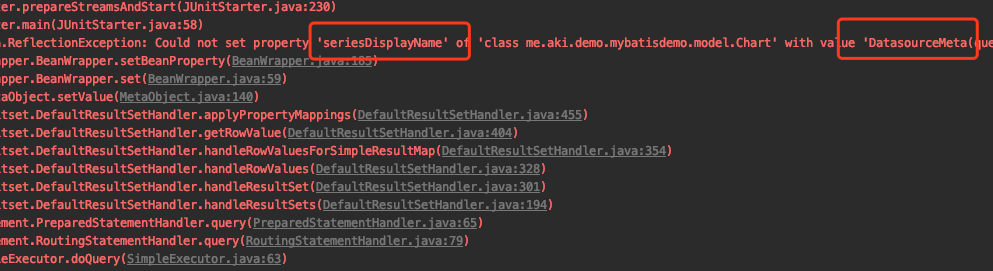
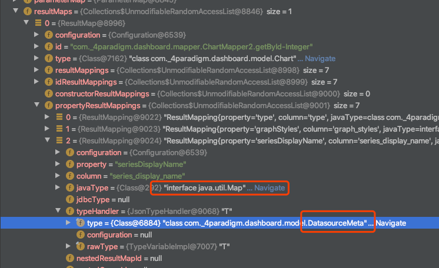

Mybatis 的 TypeHandler 是用来将 JavaBean 的属性与数据库中的字段值互相转换的，如果我们的 JavaBean 的属性是简单的属性如 String, Integer, Enum 等，我们一般不用关心 Mybatis 的 TypeHandler，但是如果我们需要将 JavaBean 的复杂对象作为一个字段值存储在数据表中，则需要自定义 TypeHandler 来处理值的映射，比较常见的处理是将复杂对象转换成一个 Json 字符串存储在数据库中，因此需要自定义 JsonTypeHandler，并且我们希望这个 JsonTypeHandler 能够处理泛型。

但是最近写一个代码的时候发现 Mybatis 对于 JavaBean 的一个 Map 属性去获取对应的 TypeHandler 时拿错了泛型对应的类型，促使我看了看 Mybatis 到底是如何加载 TypeHandler，如果获取 TypeHandler，如果获取的

## 1 起因
在一个 springboot 项目里，在 application.properteis 文件中配置了 typehandler 的 package
```
mybatis.type-handlers-package=me.aki.demo.mybatisdemo.typehandler
```
并定义了如下 JsonTypeHandler
```java
@MappedJdbcTypes(JdbcType.VARCHAR)
@MappedTypes({Map.class, List.class, ChartType.class, GraphType.class, DatasourceMeta.class})
public class JsonTypeHandler<T> extends BaseTypeHandler<T> {
    private final Class<T> type;

    public JsonTypeHandler(final Class<T> type) {
        this.type = type;
    }

    @Override
    public void setNonNullParameter(PreparedStatement ps, int i, T parameter, JdbcType jdbcType) throws SQLException {
        ps.setString(i, serializeAsJsonString(parameter));
    }

    @Override
    public T getNullableResult(ResultSet rs, String columnName) throws SQLException {
        return deserializeFromJson(rs.getString(columnName), type);
    }

    @Override
    public T getNullableResult(ResultSet rs, int columnIndex) throws SQLException {
        return deserializeFromJson(rs.getString(columnIndex), type);
    }

    @Override
    public T getNullableResult(CallableStatement cs, int columnIndex) throws SQLException {
        return deserializeFromJson(cs.getString(columnIndex), type);
    }
}
```
定义了一个 Mapper 类以及 getById 的方法
```java
    @Select("select * from chart where id = #{chartId}")
    @Results({
            @Result(column = "type", property = "type", typeHandler = ChartTypeHandler.class),
            @Result(column = "graph_styles", property = "graphStyles", typeHandler = GraphStylesTypeHandler.class),
            @Result(column = "series_display_name", property = "seriesDisplayName", typeHandler = JsonTypeHandler.class),
            @Result(column = "stats", property = "stats", typeHandler = StatsTypeHandler.class),
            @Result(column = "headers", property = "headers", typeHandler = HeadersTypeHandler.class),
            @Result(column = "datasource_meta", property = "datasourceMeta", typeHandler = DataSourceMetaTypeHandler.class),
            @Result(column = "top_cells", property = "topCells", typeHandler = TopCellsTypeHandler.class),
    })
    Chart getById(@Param("chartId") Integer chartId);
```
然后调用 getById 的方法时报了如下的错误

再 debug 一下发现是 mybatis 在设置 seriesDisplayName 这个属性时虽然使用了 JsonTypeHandler 但是泛型却错了

## 2 Mybatis TypeHandler 的注册
TypeHandler 的注册都是通过 TypeHandlerRegistry 这个类完成的，mybatis 已经预先定义了一些常用的 typehandler，需要特别注意的是 `TYPE_HANDLER_MAP` 和 `ALL_TYPE_HANDLERS_MAP`这两个属性
```java
  private final Map<JdbcType, TypeHandler<?>> JDBC_TYPE_HANDLER_MAP = new EnumMap<JdbcType, TypeHandler<?>>(JdbcType.class);
  private final Map<Type, Map<JdbcType, TypeHandler<?>>> TYPE_HANDLER_MAP = new ConcurrentHashMap<Type, Map<JdbcType, TypeHandler<?>>>();
  private final TypeHandler<Object> UNKNOWN_TYPE_HANDLER = new UnknownTypeHandler(this);
  private final Map<Class<?>, TypeHandler<?>> ALL_TYPE_HANDLERS_MAP = new HashMap<Class<?>, TypeHandler<?>>();
```
mybatis 中 javaType 与 jdbcType 是 多对多 的关系，对于 `String` 来说，可以映射的 jdbcType 有 `CHAR` `VARCHAR` 等等， 特别的，jdbcType 也可以指定为 null，用于为 javaType 对应的 jdbcType 未被用户定义的情况，如下是 `String` 对应的注册关系
```java
    register(String.class, JdbcType.CHAR, new StringTypeHandler());
    register(String.class, JdbcType.CLOB, new ClobTypeHandler());
    register(String.class, JdbcType.VARCHAR, new StringTypeHandler());
    register(String.class, JdbcType.LONGVARCHAR, new ClobTypeHandler());
    register(String.class, JdbcType.NVARCHAR, new NStringTypeHandler());
    register(String.class, JdbcType.NCHAR, new NStringTypeHandler());
    register(String.class, JdbcType.NCLOB, new NClobTypeHandler());
```
`TYPE_HANDLER_MAP` 维护了这样的多对多的关系，而 `ALL_TYPE_HANDLERS_MAP` 则是简单粗暴的将 handler 的 class 与 handler 本身对应起来，所以对于 `ALL_TYPE_HANDLERS_MAP` 来说，接收泛型的 typehandler 在注册的时候存在覆盖的情况。


当使用 springboot 的自动注入时，spring 在构建 SqlSession 时通过 SqlSessionFactoryBean 处理 mybatis 的属性并注册 typehandler
```java
SqlSessionFactoryBean#buildSqlSessionFactory
    ...
    if (hasLength(this.typeHandlersPackage)) {
      String[] typeHandlersPackageArray = tokenizeToStringArray(this.typeHandlersPackage,
          ConfigurableApplicationContext.CONFIG_LOCATION_DELIMITERS);
      for (String packageToScan : typeHandlersPackageArray) {
        // 注册 handler
        configuration.getTypeHandlerRegistry().register(packageToScan);
        if (LOGGER.isDebugEnabled()) {
          LOGGER.debug("Scanned package: '" + packageToScan + "' for type handlers");
        }
      }
    }
    ...
```
调用了 TypeHandlerRegistry 的 register 如下
```java
  public void register(Class<?> typeHandlerClass) {
    boolean mappedTypeFound = false;
    MappedTypes mappedTypes = typeHandlerClass.getAnnotation(MappedTypes.class);
    if (mappedTypes != null) {
      for (Class<?> javaTypeClass : mappedTypes.value()) {
        // 对于注解了 MappedTypes 的，将 MappedTypes 的值作为 key 存入 TYPE_HANDLER_MAP 中
        register(javaTypeClass, typeHandlerClass);
        mappedTypeFound = true;
      }
    }
    if (!mappedTypeFound) {
      register(getInstance(null, typeHandlerClass));
    }
  }

  // 对于泛型的 typehandler，初始化一个其泛型对应的 typehandler
  public <T> TypeHandler<T> getInstance(Class<?> javaTypeClass, Class<?> typeHandlerClass) {
    if (javaTypeClass != null) {
      try {
        Constructor<?> c = typeHandlerClass.getConstructor(Class.class);
        return (TypeHandler<T>) c.newInstance(javaTypeClass);
      } catch (NoSuchMethodException ignored) {
        // ignored
      } catch (Exception e) {
        throw new TypeException("Failed invoking constructor for handler " + typeHandlerClass, e);
      }
    }
    try {
      Constructor<?> c = typeHandlerClass.getConstructor();
      return (TypeHandler<T>) c.newInstance();
    } catch (Exception e) {
      throw new TypeException("Unable to find a usable constructor for " + typeHandlerClass, e);
    }
  }

  // 如果没有 MappedTypes，则从 typeReference 中推测其类型
  public <T> void register(TypeHandler<T> typeHandler) {
    boolean mappedTypeFound = false;
    MappedTypes mappedTypes = typeHandler.getClass().getAnnotation(MappedTypes.class);
    if (mappedTypes != null) {
      for (Class<?> handledType : mappedTypes.value()) {
        register(handledType, typeHandler);
        mappedTypeFound = true;
      }
    }
    // @since 3.1.0 - try to auto-discover the mapped type
    if (!mappedTypeFound && typeHandler instanceof TypeReference) {
      try {
        TypeReference<T> typeReference = (TypeReference<T>) typeHandler;
        register(typeReference.getRawType(), typeHandler);
        mappedTypeFound = true;
      } catch (Throwable t) {
        // maybe users define the TypeReference with a different type and are not assignable, so just ignore it
      }
    }
    if (!mappedTypeFound) {
      register((Class<T>) null, typeHandler);
    }
  }

  // 如果指定了 jdbcType，则在 TYPE_HANDLER_MAP 中的 value 中的 map 上 key 设置为 jdbcType，否则 key 设置为 null
  private <T> void register(Type javaType, TypeHandler<? extends T> typeHandler) {
    MappedJdbcTypes mappedJdbcTypes = typeHandler.getClass().getAnnotation(MappedJdbcTypes.class);
    if (mappedJdbcTypes != null) {
      for (JdbcType handledJdbcType : mappedJdbcTypes.value()) {
        register(javaType, handledJdbcType, typeHandler);
      }
      if (mappedJdbcTypes.includeNullJdbcType()) {
        register(javaType, null, typeHandler);
      }
    } else {
      register(javaType, null, typeHandler);
    }
  }

  // 最终将 javaType，jdbcType，typehandler 写入 TYPE_HANDLER_MAP
  // 将 handler.getClass() 与 handler 写入 ALL_TYPE_HANDLERS_MAP
  private void register(Type javaType, JdbcType jdbcType, TypeHandler<?> handler) {
    if (javaType != null) {
      Map<JdbcType, TypeHandler<?>> map = TYPE_HANDLER_MAP.get(javaType);
      if (map == null) {
        map = new HashMap<JdbcType, TypeHandler<?>>();
        TYPE_HANDLER_MAP.put(javaType, map);
      }
      map.put(jdbcType, handler);
    }
    ALL_TYPE_HANDLERS_MAP.put(handler.getClass(), handler);
  }
```
register 方法跳转很多，总的来说要处理几件事情
1. 没有指定 MappedTypes 的情况下根据 handler 的 TypeReference 拿到其原始类型作为 javaType，指定了 MappedTypes 的情况下则使用 MappedTypes 作为其 javaType，并构造一个该 MappedType 对应的 handler
2. 没有指定 jdbcType 的情况下，使用 null 作为 jdbcType，否则使用指定的 jdbcType

需要注意的点是
1. 假设我们注册了多个 `xx entends BaseTypeHandler<List<T>>` ，那么他们 typeRerence 的 rawType 都是 List.class，这个 rawType 也就是 javaType 会作为 `TYPE_HANDLER_MAP` 中的 key，所以如果这多个 handler 的 jdbcType 也是一样的，那么这多个 handler 会在 `TYPE_HANDLER_MAP` 中被最后一个注册的覆盖
2. `ALL_TYPE_HANDLERS_MAP` 对于泛型的 handler，存在相互覆盖，如上文定义的 JsonTypeHandler, 最后只会留下 `{JsonTypeHandler, JsonTypeHandler<DatasourceMeta>}` 这个键值对

基本的注册流程就是这样子，下面我们来看下 Mybatis 是和做数据库值到 JavaBean 的转换的

## 3 DB Value 转换成 JavaBean
Mybatis 在启动时就会解析我们定义的 Mapper 类，以上文提到的 mapper 为例
```java
    @Select("select * from chart where id = #{chartId}")
    @Results({
            @Result(column = "type", property = "type", typeHandler = ChartTypeHandler.class),
            @Result(column = "graph_styles", property = "graphStyles", typeHandler = GraphStylesTypeHandler.class),
            @Result(column = "series_display_name", property = "seriesDisplayName", typeHandler = JsonTypeHandler.class),
            @Result(column = "stats", property = "stats", typeHandler = StatsTypeHandler.class),
            @Result(column = "headers", property = "headers", typeHandler = HeadersTypeHandler.class),
            @Result(column = "datasource_meta", property = "datasourceMeta", typeHandler = DataSourceMetaTypeHandler.class),
            @Result(column = "top_cells", property = "topCells", typeHandler = TopCellsTypeHandler.class),
    })
    Chart getById(@Param("chartId") Integer chartId);
```
我们用注解的方式定义了数据库中的 column 与 javaBean 的 property 如何映射，以及使用什么 handler。Mybatis 会通过 MapperAnnotaionBuilder 类完成对该方法的解析，并设置 column 与 property 的映射关系
```java
  private void applyResultMap(String resultMapId, Class<?> returnType, Arg[] args, Result[] results,    TypeDiscriminator discriminator) {
    List<ResultMapping> resultMappings = new ArrayList<>();
    applyConstructorArgs(args, returnType, resultMappings);
    applyResults(results, returnType, resultMappings);
    Discriminator disc = applyDiscriminator(resultMapId, returnType, discriminator);
    // TODO add AutoMappingBehaviour
    assistant.addResultMap(resultMapId, returnType, null, disc, resultMappings, null);
    createDiscriminatorResultMaps(resultMapId, returnType, discriminator);
  }
```
我们一路跟踪 applyResults(results, returnType, resultMappings) 这个调用链
```java
1. MapperAnnotaionBuilder#applyResults
2. MapperBuilderAssistant#buildResultMapping
3. BaseBuilder#resolveTypeHandler


  // 如果我们的 result 注解里指定了 handler，则最终在这里根据 class 获取 handler
  protected TypeHandler<?> resolveTypeHandler(Class<?> javaType, Class<? extends TypeHandler<?>> typeHandlerType) {
    if (typeHandlerType == null) {
      return null;
    }
    // javaType ignored for injected handlers see issue #746 for full detail
    TypeHandler<?> handler = typeHandlerRegistry.getMappingTypeHandler(typeHandlerType);
    if (handler == null) {
      // not in registry, create a new one
      handler = typeHandlerRegistry.getInstance(javaType, typeHandlerType);
    }
    return handler;
  }
```
而 TypeHandlerRegistry#getMappingTypeHandler 如下
```java
  public TypeHandler<?> getMappingTypeHandler(Class<? extends TypeHandler<?>> handlerType) {
    return allTypeHandlersMap.get(handlerType);
  }
```
可以看到在我们定义了 result 里的 typehandler 时，是直接根据 typehandler 的 class 去 allTypeHandlersMap 拿 handler 的，而我们前文说过，allTypeHandlersMap 中的值是会被覆盖的，这就解释了为什么最后那个 mapper 方法会因为泛型错误而无法进行类型转换了。

如果我们删除 @Result(column = "series_display_name", property = "seriesDisplayName", typeHandler = JsonTypeHandler.class) 中的 typeHandler 则程序能正常运行，正如上文中的 resolveTypeHandler，当我们删除 typeHandler 时，typeHandler 为 null，然后走了 `handler = typeHandlerRegistry.getInstance(javaType, typeHandlerType)` 这个逻辑，也就是会新建一个正确合适的 handler。

这是在程序初始化时完成的事情，对于标注了 @Result 的 property 会在 MapperAnnotaionBuilder 中完成 mapping 的映射，其他的属性则是在运行过程中完成映射的，我们跟踪一下代码的执行链路
1. 执行 query
2. DefaultResultSetHandler#handleReusltSets
3. DefaultResultSetHandler#handleResultSet
4. DefaultResultSetHandler#handleRowValues
5. DefaultResultSetHandler#getRowValue
6. DefaultResultSetHandler#applyAutomaticMappings
7. DefaultResultSetHandler#createAutomaticMappings

```java
DefaultResultSetHandler#createAutomaticMappings

    if (property != null && metaObject.hasSetter(property)) {
      if (resultMap.getMappedProperties().contains(property)) {
        continue;
      }
      final Class<?> propertyType = metaObject.getSetterType(property);
      if (typeHandlerRegistry.hasTypeHandler(propertyType, rsw.getJdbcType(columnName))) {
        // 获取 typehandler 的关键代码
        final TypeHandler<?> typeHandler = rsw.getTypeHandler(propertyType, columnName);
        autoMapping.add(new UnMappedColumnAutoMapping(columnName, property, typeHandler, propertyType.isPrimitive()));
      } else {
        configuration.getAutoMappingUnknownColumnBehavior()
            .doAction(mappedStatement, columnName, property, propertyType);
      }
    } else {
      configuration.getAutoMappingUnknownColumnBehavior()
          .doAction(mappedStatement, columnName, (property != null) ? property : propertyName, null);
    }
```
ResultSetWrapper 获取 TypeHandler 的关键代码如下
```java
ResultSetWrapper#getTypeHandler
  ...
  JdbcType jdbcType = getJdbcType(columnName);
  handler = typeHandlerRegistry.getTypeHandler(propertyType, jdbcType);
  ...

TypeHandlerRegistry#getTypeHandler

  private <T> TypeHandler<T> getTypeHandler(Type type, JdbcType jdbcType) {
    if (ParamMap.class.equals(type)) {
      return null;
    }
    Map<JdbcType, TypeHandler<?>> jdbcHandlerMap = getJdbcHandlerMap(type);
    TypeHandler<?> handler = null;
    if (jdbcHandlerMap != null) {
      handler = jdbcHandlerMap.get(jdbcType);
      if (handler == null) {
        handler = jdbcHandlerMap.get(null);
      }
      if (handler == null) {
        // #591
        handler = pickSoleHandler(jdbcHandlerMap);
      }
    }
    // type drives generics here
    return (TypeHandler<T>) handler;
  }
```
也就是根据 propertyType 从 `TYPE_HANDLER_MAP` 中拿 jdbcHandlerMap，如果能不能根据 jdbcType 拿到 handler 则用 null 去拿 handler，至此，所有的 handler 的获取逻辑就理完了，总结一下获取 typehandler 分两步：
1. 如果定义 @Result，则在 Mybatis 初始化的时候就会配置好相应的 typehandler，且是从 `ALL_TYPE_HANDLERS_MAP` 取 handler，如果取到为空则新建一个 handler
2. 对于未在 @Result 中定义的 property 是在运行时获取 handler 的，且是从 `TYPE_HANDLER_MAP` 中获取，取不到的话，这个值最终会被忽略


